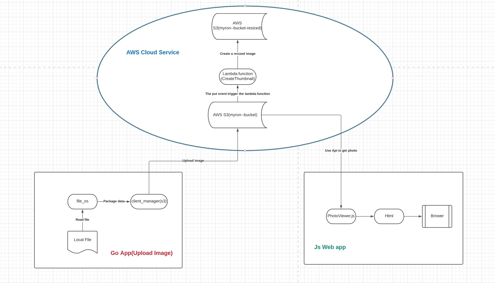
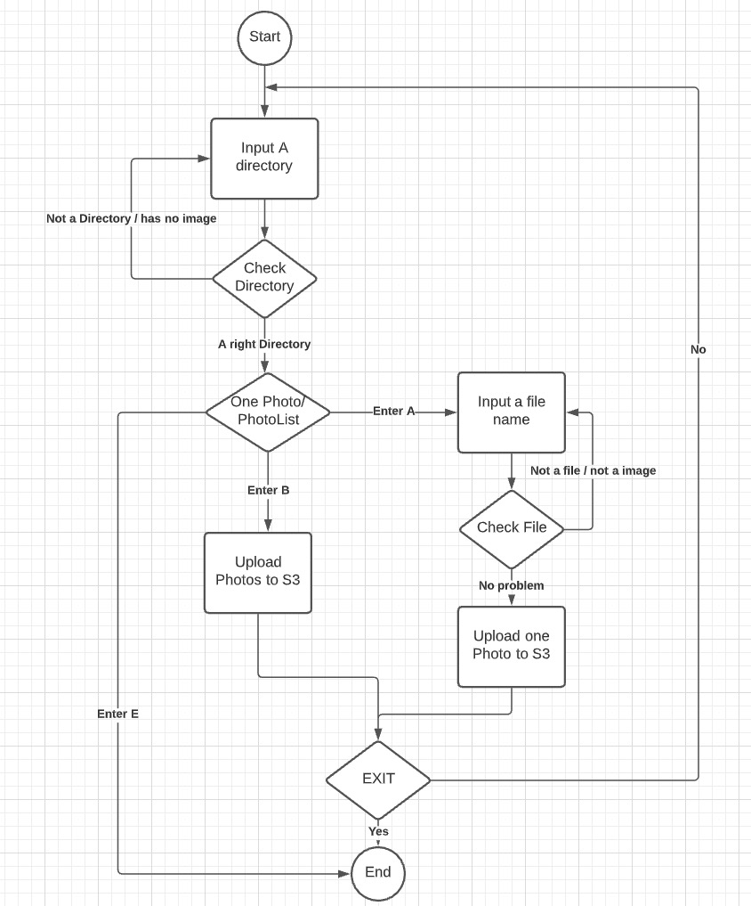

# Photo Processing Service

## Overview:

In this project, I developed a Go app to provide Photo Processing Service. This app enables the user to submit photos or a group of photos, process them in an appropriate source and ensure their photo object and metadata are able to be retrieved for later synchronous retrieval. Leverage the lambda function to create the resized photo, when the user uploads the photo. Using JavaScript to develop a web app to retrieved photos and metadata.

## Technology:
- Language: Go, JavaScript, Html
- Develop Tool: VS code
- Build Tool: go mod and npm
- Cloud Service: AWS S3, Lambda

## Architecture:

## Workflow:

## Go App Implement:

-	Create an IAM user for Go App (USER_FOR_S3_PPAS)
-	Create a new bucket in s3 called “myron--bucket”
-	Start to develop the application. 
-	Create a new file “file_os.go” which is used to read local file and get metadata
-	Create a new file “client_manager.go”  which is used to upload photo to s3
-	Create a new file “myapp.go”  which is used to control the work flow.
-	Create test case to help debug.

## Web App Implement:
-	Create an Amazon Cognito identity pool in “myron--bucket”
-	Config the “myron--bucket” to be public
-	Create a new policy in IAM
-	Configure CORS
-	Start to develop the web application. Just to file index.html and PhotoViewer.js

## Lambda Function Implement:
-	Create the IAM Policy
-	Create the execution role
-	Create the function code.
-	Create the deployment package
-	Create the Lambda function
-	Configure Amazon S3 to publish events

